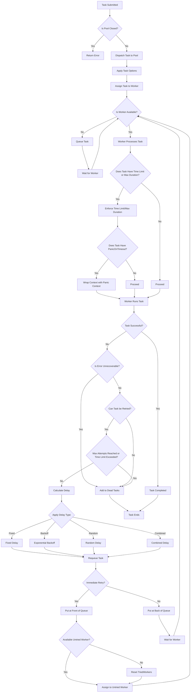

# retrypool

[](https://godoc.org/github.com/davidroman0O/retrypool)
[](https://goreportcard.com/report/github.com/davidroman0O/retrypool)
[](https://opensource.org/licenses/MIT)

**retrypool** is a robust, flexible, and highly configurable Go library that provides a powerful worker pool with customizable retry mechanisms and advanced backoff strategies. It simplifies concurrent task processing by managing retries, delays, error handling, and dynamic worker management, allowing developers to focus on building resilient applications without reinventing the wheel.

## Features

- **Dynamic Worker Management**: Add or remove workers from the pool at runtime.
- **Worker Interruption**: Interrupt and requeue tasks from specific workers.
- **Customizable Retries**: Define the number of retry attempts per task.
- **Backoff Strategies**: Implement fixed, exponential, random, or custom backoff delays.
- **Flexible Task Distribution**: Tasks are distributed to workers that haven't tried them before.
- **Context Awareness**: Support for context cancellation and timeouts.
- **Error Handling**: Distinguish between recoverable and unrecoverable errors.
- **Task Time Limits**: Set time limits for individual tasks and per-attempt durations.
- **Dead Task Tracking**: Collect tasks that failed after all retry attempts.
- **Custom Retry Conditions**: Specify conditions under which tasks should be retried.
- **Task Callbacks**: Define callbacks for successful and failed task completions.
- **Detailed Task History**: Track errors and durations for each task attempt.
- **Custom Timer Support**: Implement custom timers for specialized timing needs.
- **Max Delay and Jitter**: Configure maximum delay and random jitter for retry attempts.
- **Combine Delay Strategies**: Mix multiple delay strategies for advanced retry behavior.
- **Panic on Timeout**: Optionally trigger a panic when a task exceeds its timeout.

## Table of Contents

- [Installation](#installation)
- [Getting Started](#getting-started)
- [Task Lifecycle Mechanism](#task-lifecycle-mechanism)
- [Usage Examples](#usage-examples)
  - [Basic Usage](#basic-usage)
  - [Dynamic Worker Management](#dynamic-worker-management)
  - [Custom Retry Logic](#custom-retry-logic)
  - [Context Cancellation](#context-cancellation)
  - [HTTP Use Case](#http-use-case)
- [API Documentation](#api-documentation)
- [Contributing](#contributing)
- [License](#license)
- [Motivation for Creating retrypool](#motivation-for-creating-retrypool)
- [Documentation](#documentation)

## Installation

```bash
go get github.com/davidroman0O/retrypool
```

## Getting Started

To start using **retrypool**, you need to implement the `Worker` interface for your task type and create a new pool with the desired configuration.

```go
type Worker[T any] interface {
    Run(ctx context.Context, data T) error
}
```

Here is a basic example:

```go
package main

import (
    "context"
    "fmt"
    "log"
    "time"

    "github.com/davidroman0O/retrypool"
)

type SimpleWorker struct{}

func (w *SimpleWorker) Run(ctx context.Context, data int) error {
    // Simulate work by sleeping
    time.Sleep(time.Duration(data) * time.Millisecond)
    fmt.Printf("Processed: %d\n", data)
    return nil
}

func main() {
    ctx := context.Background()
    workers := []retrypool.Worker[int]{&SimpleWorker{}, &SimpleWorker{}}
    pool := retrypool.NewPool(ctx, workers)

    for i := 1; i <= 10; i++ {
        err := pool.Dispatch(i*100, retrypool.WithMaxDuration[int](time.Second))
        if err != nil {
            log.Printf("Dispatch error: %v", err)
        }
    }

    // Wait for all tasks to complete
    pool.Close()
    fmt.Println("All tasks completed")
}
```

## Task Lifecycle Mechanism

The following diagram illustrates how tasks are processed:



### Overview of the Task Processing Algorithm

1. **Task Submission and Dispatching**
   - **Task Creation**: A task is created and submitted to the pool using the `Dispatch` method.
   - **Pool Status Check**: The pool checks if it's currently accepting new tasks.
     - **If Closed**: An error is returned, indicating that no new tasks can be accepted.
     - **If Open**: The task proceeds to the next step.
   - **Applying Task Options**: Any task-specific options (e.g., time limits, immediate retry) are applied to configure its behavior.

2. **Worker Assignment**
   - **Task Queuing**: The task is placed into the appropriate queue within the pool.
     - **Queue Selection**: Tasks are assigned to queues based on retry attempts or other criteria.
   - **Worker Availability Check**: Workers continuously check for tasks in their assigned queues.
     - **If Worker Available**: The task is dequeued and assigned to the available worker.
     - **If No Worker Available**: The task remains in the queue until a worker becomes available.

3. **Task Execution**
   - **Context Management**: A context is created for the task, which may include timeouts or cancellation signals.
     - **Time Limits and Max Duration**: If specified, the task enforces time limits for total execution time or per-attempt duration.
     - **Panic on Timeout**: If enabled, the task's context is wrapped to trigger a panic if a timeout occurs.
   - **Worker Processing**: The assigned worker begins processing the task using its `Run` method.
     - **Error Handling**: Any errors during execution are captured for further evaluation.

4. **Task Outcome Determination**
   - **Success Check**: The pool checks if the task completed successfully.
     - **If Successful**: The task is marked as completed, and any success callbacks are invoked.
     - **If Failed**: The error is evaluated to determine the next steps.

5. **Error Handling and Retry Logic**
   - **Unrecoverable Errors**: If the error is deemed unrecoverable, the task is added to the dead tasks list.
   - **Retry Eligibility Check**: The pool checks if the task can be retried based on:
     - **Retry Conditions**: Configurable conditions determine if a retry should occur (e.g., specific error types).
     - **Max Attempts**: The task's retry count is compared against the maximum allowed attempts.
     - **Time Limits**: Total execution time is checked against any specified time limits.
   - **Proceeding with Retry**: If eligible, the task is prepared for retry.

6. **Delay Calculation and Requeuing**
   - **Delay Determination**: The pool calculates the delay before the next retry using the configured delay type:
     - **Fixed Delay**: A constant delay between retries.
     - **Exponential Backoff**: Delay increases exponentially with each retry attempt.
     - **Random Jitter**: Adds randomness to the delay to prevent thundering herd problems.
     - **Combined Delay**: Uses a combination of the above strategies.
   - **Task Requeuing**: The task is requeued with the calculated delay.
     - **Immediate Retry Option**: If enabled, the task is placed at the front of the queue for quicker retry.
     - **Worker Assignment**: The task may be assigned to a different worker, especially if some workers have not yet attempted it.

7. **Worker Management**
   - **Dynamic Worker Addition**: New workers can be added to the pool at runtime using the `AddWorker` method.
   - **Worker Removal**: Workers can be gracefully removed from the pool using the `RemoveWorker` method.
     - **Task Reassignment**: Tasks assigned to a removed worker are requeued and reassigned.
     - **Force Removal**: If a worker does not stop within a specified timeout, it can be forcefully terminated.
   - **Worker Contexts**: Each worker operates within its own context, allowing for individual cancellation or timeout handling.

8. **Pool Lifecycle Management**
   - **Graceful Shutdown**: The `Close` method stops the pool from accepting new tasks and waits for all running tasks to complete.
   - **Forceful Shutdown**: The `ForceClose` method stops the pool immediately without waiting for tasks to finish.
   - **Monitoring and Callbacks**: The pool provides mechanisms to monitor its state and invoke callbacks on task success or failure.
     - **OnTaskSuccess Callback**: Invoked when a task completes successfully.
     - **OnTaskFailure Callback**: Invoked when a task fails and cannot be retried.

9. **Dead Task Handling**
   - **Dead Tasks List**: Tasks that have failed permanently are added to the dead tasks list.
   - **Retrieval**: Users can retrieve the list of dead tasks using the `DeadTasks` method for inspection or logging.

10. **Configurable Options and Customization**
    - **Retry Policies**: Customize retry behavior using options like `WithAttempts`, `WithRetryIf`, and `WithDelayType`.
    - **Delay Strategies**: Implement custom delay strategies by providing a `DelayTypeFunc`.
    - **Task Options**: Individual tasks can have specific settings, such as maximum duration or immediate retry preference.
    - **Context Customization**: Use `WithWorkerContext` to define how worker contexts are created.
    - **Callbacks and Hooks**: Integrate custom logic by setting `OnRetry`, `OnTaskSuccess`, and `OnTaskFailure` functions.

This mechanism ensures that tasks have multiple opportunities to complete successfully, with built-in safeguards against indefinite retries. The flexible worker assignment allows for efficient resource utilization and fault tolerance.

## Usage Examples

### Basic Usage

Create a pool with workers and dispatch tasks:

```go
ctx := context.Background()
workers := []retrypool.Worker[MyTaskType]{&MyWorker{}, &MyWorker{}}
pool := retrypool.NewPool(ctx, workers)

for _, taskData := range myTaskDataList {
    pool.Dispatch(taskData)
}

// Close the pool when done
pool.Close()
```

### Dynamic Worker Management

You can add or remove workers at runtime:

```go
// Adding a new worker
newWorker := &MyWorker{}
workerID := pool.AddWorker(newWorker)
fmt.Printf("Added worker with ID: %d\n", workerID)

// Removing a worker
err := pool.RemoveWorker(workerID)
if err != nil {
    log.Printf("Error removing worker: %v", err)
} else {
    fmt.Printf("Removed worker with ID: %d\n", workerID)
}
```

### Custom Retry Logic

Customize retry attempts and backoff strategies:

```go
pool := retrypool.NewPool(ctx, workers,
    retrypool.WithAttempts[MyTaskType](5),
    retrypool.WithDelay[MyTaskType](time.Second),
    retrypool.WithDelayType[MyTaskType](retrypool.BackOffDelay[MyTaskType]),
)
```

### Context Cancellation

Use context to cancel the pool or tasks:

```go
ctx, cancel := context.WithTimeout(context.Background(), time.Minute)
defer cancel()

pool := retrypool.NewPool(ctx, workers)
```

### HTTP Use Case

Here's an example of using **retrypool** to manage HTTP requests with different authentication tokens:

```go
type HTTPWorker struct {
    client *http.Client
    token  string
}

func (w *HTTPWorker) Run(ctx context.Context, url string) error {
    req, err := http.NewRequestWithContext(ctx, http.MethodGet, url, nil)
    if err != nil {
        return retrypool.Unrecoverable(err)
    }
    req.Header.Set("Authorization", "Bearer "+w.token)
    resp, err := w.client.Do(req)
    if err != nil {
        return err
    }
    defer resp.Body.Close()

    if resp.StatusCode == http.StatusTooManyRequests {
        return fmt.Errorf("rate limited")
    }
    if resp.StatusCode >= 500 {
        return fmt.Errorf("server error")
    }
    if resp.StatusCode != http.StatusOK {
        return retrypool.Unrecoverable(fmt.Errorf("unexpected status: %d", resp.StatusCode))
    }

    // Process response...
    return nil
}

func main() {
    tokens := []string{"token1", "token2", "token3"}
    var workers []retrypool.Worker[string]
    for _, token := range tokens {
        workers = append(workers, &HTTPWorker{
            client: &http.Client{},
            token:  token,
        })
    }

    pool := retrypool.NewPool(context.Background(), workers,
        retrypool.WithAttempts[string](retrypool.UnlimitedAttempts),
        retrypool.WithRetryIf[string](func(err error) bool {
            // Retry on rate limiting or server errors
            return strings.Contains(err.Error(), "rate limited") || strings.Contains(err.Error(), "server error")
        }),
        retrypool.WithDelayType[string](retrypool.CombineDelay(
            retrypool.BackOffDelay[string],
            retrypool.RandomDelay[string],
        )),
    )

    urls := []string{"https://api.example.com/data1", "https://api.example.com/data2"}
    for _, url := range urls {
        pool.Dispatch(url)
    }

    pool.Close()
}
```

## API Documentation

For detailed API usage and advanced configurations, please refer to the [Documentation](documentation.md).

## Contributing

Contributions are welcome! Please open an issue or submit a pull request for any bugs, improvements, or features.

## License

This project is licensed under the MIT License - see the [LICENSE](LICENSE) file for details.

## Motivation for Creating retrypool

The **retrypool** library was developed to address specific challenges in distributed systems involving API requests with multiple authentication tokens. The primary motivations were:

1. **Multiple Workers with Distinct Credentials**: In scenarios where an application needs to make API requests using different bearer tokens, it's crucial to have a pool of workers, each potentially using a unique authentication credential.

2. **Handling Faulty Workers**: Sometimes, a specific worker (or its associated token) might become temporarily or permanently faulty. This could be due to rate limiting, token expiration, or other API-specific issues.

3. **Automatic Task Redistribution**: Instead of a task being stuck retrying indefinitely on a faulty worker, there was a need for tasks to be automatically moved to different workers in the pool.

4. **Flexible Retry Mechanisms**: The ability to customize retry logic, including the number of attempts, delay between retries, and conditions for retrying, was essential for adapting to various API behaviors and requirements.

5. **Lack of Existing Solutions**: After searching for existing libraries on GitHub that could handle this specific combination of requirements, no suitable solution was found.

The **retrypool** library was created to fill this gap, providing a robust solution for managing a pool of workers with different credentials, automatically redistributing tasks when a worker encounters issues, and offering flexible retry mechanisms. This approach ensures more resilient and efficient handling of API requests in distributed systems, especially when dealing with multiple authentication tokens and varying API behaviors.

## Documentation

[View the full documentation](./docs/documentation.md) for detailed information on:

- **Pool Configuration**: Learn how to set up and configure the pool to suit your needs.
- **Worker Interface**: Understand how to implement the `Worker` interface for your tasks.
- **Dispatching Tasks**: See how to dispatch tasks to the pool with optional configurations.
- **Retry Logic**: Customize retry behavior with different strategies and conditions.
- **Dynamic Worker Management**: Add or remove workers at runtime and manage worker states.
- **Delay Types**: Implement custom delay functions for advanced retry strategies.
- **Error Handling**: Distinguish between recoverable and unrecoverable errors.
- **Context Management**: Utilize contexts to control task and pool lifecycles.
- **Advanced Usage**: Explore advanced features like custom timers, task time limits, and more.
- **Examples**: Check out practical examples to get started quickly.
- **FAQ**: Find answers to common questions.
