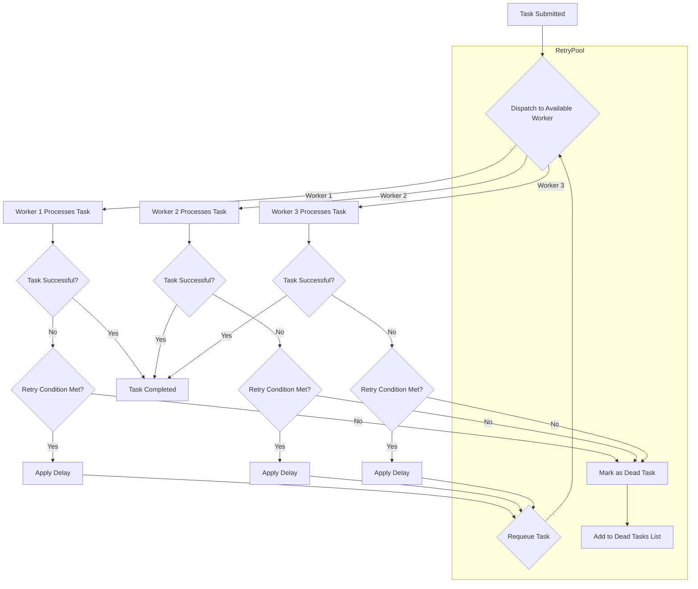

# retrypool

[](https://godoc.org/github.com/davidroman0O/retrypool)
[](https://goreportcard.com/report/github.com/davidroman0O/retrypool)
[](https://opensource.org/licenses/MIT)

**retrypool** is a Go library that provides a robust worker pool with customizable retry mechanisms and backoff strategies. It simplifies concurrent task processing by managing retries, delays, and error handling, allowing developers to focus on building resilient applications without reinventing the wheel.


## Features

- **Customizable Retries**: Define the number of retry attempts per task.
- **Backoff Strategies**: Implement fixed, exponential, random, or custom backoff delays.
- **Context Awareness**: Support for context cancellation and timeouts.
- **Error Handling**: Distinguish between recoverable and unrecoverable errors.
- **Task Time Limits**: Set time limits for individual tasks.
- **Multiple Workers**: Utilize multiple workers for concurrent task processing.
- **Dead Task Tracking**: Collect tasks that failed after all retry attempts.
- **Custom Retry Conditions**: Specify conditions under which tasks should be retried.

## Table of Contents

- [Installation](#installation)
- [Getting Started](#getting-started)
- [Retry mechanism](#retrypool-task-retry-mechanism)
- [Usage Examples](#usage-examples)
  - [Basic Usage](#basic-usage)
  - [Custom Retry Logic](#custom-retry-logic)
  - [Context Cancellation](#context-cancellation)
  - [HTTP Use Case](#http-use-case)
- [API Documentation](#api-documentation)
- [Contributing](#contributing)
- [License](#license)
- [Motivation for creating retrypool](#motivation-for-creating-retrypool)

## Installation

```bash
go get github.com/davidroman0O/retrypool
```

## Getting Started

To start using **retrypool**, you need to implement the `Worker` interface for your task type and create a new pool with the desired configuration.

```go
type Worker[T any] interface {
    Run(ctx context.Context, data T) error
}
```

Here a basic example:

```go
package main

import (
    "context"
    "fmt"
    "log"
    "time"

    "github.com/davidroman0O/retrypool"
)

type SimpleWorker struct{}

func (w *SimpleWorker) Run(ctx context.Context, data int) error {
    time.Sleep(time.Duration(data) * time.Millisecond)
    fmt.Printf("Processed: %d\n", data)
    return nil
}

func main() {
    ctx := context.Background()
    workers := []retrypool.Worker[int]{&SimpleWorker{}, &SimpleWorker{}}
    pool := retrypool.NewPool(ctx, workers)

    for i := 1; i <= 10; i++ {
        err := pool.Dispatch(i * 100)
        if err != nil {
            log.Printf("Dispatch error: %v", err)
        }
    }

    pool.Close()
    fmt.Println("All tasks completed")
}
```

# RetryPool Task Retry Mechanism

The following diagram illustrates how tasks are processed and retried in the RetryPool library:



1. **Task Submission**: A task is submitted to the RetryPool.

2. **Worker Assignment**: The task is dispatched to an available worker (Worker 1, Worker 2, or Worker 3).

3. **Task Processing**: The assigned worker processes the task.

4. **Success Check**: The system checks if the task was completed successfully.
   - If successful, the task is marked as completed.
   - If unsuccessful, the system moves to the retry logic.

5. **Retry Condition**: The system checks if the retry condition is met (e.g., maximum attempts not reached, error is retryable).
   - If the condition is met, a delay is applied before requeueing.
   - If the condition is not met, the task is marked as a dead task.

6. **Delay Application**: If a retry is needed, the system applies a delay (which can be fixed, exponential backoff, or custom).

7. **Task Requeuing**: After the delay, the task is requeued and becomes available for dispatch again.

8. **Dead Task Handling**: Tasks that have exhausted their retry attempts or met unrecoverable errors are added to the Dead Tasks List.

This mechanism ensures that tasks have multiple opportunities to complete successfully, with built-in safeguards against indefinite retries. The flexible worker assignment allows for efficient resource utilization and fault tolerance.

## API Documentation

For detailed API usage and advanced configurations, please refer to the [Documentation](documentation.md).

## Contributing

Contributions are welcome! Please open an issue or submit a pull request for any bugs, improvements, or features.

## License

This project is licensed under the MIT License - see the [LICENSE](LICENSE) file for details.

## Motivation for creating retrypool

The retrypool library was developed to solve a particular challenge in distributed systems involving API requests with multiple authentication tokens. The primary motivations were:

1. **Multiple Workers with Distinct Credentials**: In scenarios where an application needs to make API requests using different bearer tokens, it's crucial to have a pool of workers, each potentially using a unique authentication credential.

2. **Handling Faulty Workers**: Sometimes, a specific worker (or its associated token) might become temporarily or permanently faulty. This could be due to rate limiting, token expiration, or other API-specific issues.

3. **Automatic Task Redistribution**: Instead of a task being stuck retrying indefinitely on a faulty worker, there was a need for tasks to be automatically moved to different workers in the pool.

4. **Flexible Retry Mechanisms**: The ability to customize retry logic, including the number of attempts, delay between retries, and conditions for retrying, was essential for adapting to various API behaviors and requirements.

5. **Lack of Existing Solutions**: After searching for existing libraries on GitHub that could handle this specific combination of requirements, no suitable solution was found.

The retrypool library was created to fill this gap, providing a robust solution for managing a pool of workers with different credentials, automatically redistributing tasks when a worker encounters issues, and offering flexible retry mechanisms. This approach ensures more resilient and efficient handling of API requests in distributed systems, especially when dealing with multiple authentication tokens and varying API behaviors.

# Documentation

## Table of Contents

- [Introduction](#introduction)
- [Getting Started](#getting-started)
- [Pool Configuration](#pool-configuration)
- [Worker Interface](#worker-interface)
- [Dispatching Tasks](#dispatching-tasks)
- [Retry Logic](#retry-logic)
- [Delay Types](#delay-types)
- [Error Handling](#error-handling)
- [Context Management](#context-management)
- [Advanced Usage](#advanced-usage)
  - [Custom Delay Functions](#custom-delay-functions)
  - [Custom Retry Conditions](#custom-retry-conditions)
  - [Task Time Limits](#task-time-limits)
  - [Dead Task Retrieval](#dead-task-retrieval)
- [Examples](#examples)
- [FAQ](#faq)

## Introduction

**retrypool** is designed to handle concurrent task processing with robust retry mechanisms. It abstracts the complexity of managing worker pools, retries, and backoff strategies, allowing developers to build resilient systems efficiently.

## Getting Started

To use **retrypool**, install it via:

```bash
go get github.com/davidroman0O/retrypool
```

Import the package in your Go code:

```go
import "github.com/davidroman0O/retrypool"
```

## Pool Configuration

Create a new pool using `retrypool.NewPool`:

```go
pool := retrypool.NewPool(ctx, workers, options...)
```

- **ctx**: The base context for the pool.
- **workers**: A slice of `Worker` instances.
- **options**: Functional options to configure the pool.

### Available Options

- `WithAttempts[T](attempts int)`: Set the maximum number of retry attempts.
- `WithDelay[T](delay time.Duration)`: Set the base delay between retries.
- `WithMaxDelay[T](maxDelay time.Duration)`: Set the maximum delay between retries.
- `WithMaxJitter[T](maxJitter time.Duration)`: Set the maximum random jitter added to delays.
- `WithDelayType[T](delayType DelayTypeFunc[T])`: Set a custom delay calculation function.
- `WithOnRetry[T](onRetry OnRetryFunc[T])`: Set a callback function invoked on retries.
- `WithRetryIf[T](retryIf RetryIfFunc)`: Set a custom condition for retrying errors.
- `WithContext[T](ctx context.Context)`: Override the pool's context.
- `WithTimer[T](timer Timer)`: Provide a custom timer implementation.

## Worker Interface

Implement the `Worker` interface for your task type:

```go
type Worker[T any] interface {
    Run(ctx context.Context, data T) error
}
```

- **Run**: Executes the task logic. Should return `nil` on success or an `error` on failure.

## Dispatching Tasks

Add tasks to the pool using `Dispatch`:

```go
err := pool.Dispatch(data, taskOptions...)
```

- **data**: The task data to process.
- **taskOptions**: Optional configurations for the individual task.

### Task Options

- `WithTimeLimit[T](limit time.Duration)`: Set a time limit for the task's total processing time.

## Retry Logic

The pool handles retries based on the configuration provided.

- **Attempts**: The maximum number of times a task will be attempted.
- **Delay**: The delay between retry attempts.
- **Backoff Strategies**: Adjust delays using strategies like fixed, exponential, or custom functions.

### Unlimited Attempts

Use `retrypool.UnlimitedAttempts` to retry indefinitely until success or context cancellation.

```go
retrypool.WithAttempts[int](retrypool.UnlimitedAttempts)
```

## Delay Types

Customize delay calculations between retries using delay functions.

- **FixedDelay**: Constant delay between retries.
- **BackOffDelay**: Exponential backoff delay.
- **RandomDelay**: Random delay up to `MaxJitter`.
- **CombineDelay**: Combine multiple delay functions.

### Example

```go
retrypool.WithDelayType[int](retrypool.CombineDelay(
    retrypool.BackOffDelay[int],
    retrypool.RandomDelay[int],
)),
```

## Error Handling

Distinguish between recoverable and unrecoverable errors.

- **Recoverable Errors**: Errors that can be retried.
- **Unrecoverable Errors**: Errors that should not be retried.

### Marking Unrecoverable Errors

Wrap errors with `retrypool.Unrecoverable` to prevent retries.

```go
return retrypool.Unrecoverable(fmt.Errorf("critical failure"))
```

### Custom Retry Conditions

Use `WithRetryIf` to provide a custom function determining whether to retry.

```go
retrypool.WithRetryIf[int](func(err error) bool {
    return errors.Is(err, ErrTemporary)
})
```

## Context Management

The pool and workers respect context cancellations and timeouts.

- **Pool Context**: Cancelling the pool's context stops all workers and tasks.
- **Task Context**: Each task receives the pool's context, which can be used to handle cancellations.

## Advanced Usage

### Custom Delay Functions

Define your own delay logic by implementing `DelayTypeFunc`.

```go
func customDelay[T any](n int, err error, config *retrypool.Config[T]) time.Duration {
    // Your custom delay calculation
}
```

Set it using:

```go
retrypool.WithDelayType[int](customDelay[int])
```

### Custom Retry Conditions

Implement complex retry conditions based on error types or contents.

```go
retrypool.WithRetryIf[int](func(err error) bool {
    // Analyze the error and decide whether to retry
})
```

### Task Time Limits

Limit the total processing time for individual tasks.

```go
pool.Dispatch(data, retrypool.WithTimeLimit[int](time.Second*5))
```

### Dead Task Retrieval

Access tasks that failed after all retry attempts using `DeadTasks`.

```go
deadTasks := pool.DeadTasks()
for _, task := range deadTasks {
    // Handle dead tasks
}
```

## Examples

### Custom Timer Implementation

You can provide a custom timer for testing or specialized timing needs.

```go
type CustomTimer struct{}

func (t *CustomTimer) After(d time.Duration) <-chan time.Time {
    // Your custom timing logic
}

retrypool.WithTimer[int](&CustomTimer{})
```

### Waiting with Callbacks

Wait for the pool to complete tasks while performing periodic checks or updates.

```go
err := pool.WaitWithCallback(ctx, func(queueSize, processingCount int) bool {
    // Return true to continue waiting, false to stop
    return queueSize > 0 || processingCount > 0
}, time.Second)
```

## FAQ

**Q:** Can I add more workers after the pool has been created?

**A:** No, the number of workers is fixed at pool creation. You need to create a new pool to change the number of workers.

---

**Q:** How does the pool handle panics within worker functions?

**A:** Panics within `Worker.Run` are recovered by the pool, and the task is retried according to the configured retry logic.

---

**Q:** Can I prioritize certain tasks over others?

**A:** Task prioritization is not built-in. You can implement custom logic within your workers or manage separate pools for different priorities.

---

**Q:** How are tasks distributed among workers?

**A:** Tasks are assigned to workers based on availability. The pool ensures that each task is eventually processed by a worker.

---

**Q:** What happens if all workers are busy?

**A:** Tasks are queued until a worker becomes available. The pool manages the queue internally.

---

**Q:** Is **retrypool** safe for concurrent use?

**A:** Yes, the pool is designed for concurrent environments and handles synchronization internally.

---

**Q:** Can I retrieve the results of tasks?

**A:** The `Worker.Run` method does not return results directly. You can modify your task data to include channels or callbacks for result delivery.

